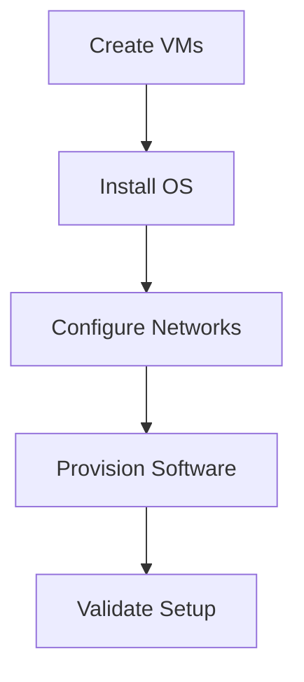

```markdown
# 🖥️ VirtualBox Lab Automation Suite (VirtualBox - Bash Script - YAML)
**Automated provisioning of complex virtual environments with multi-network support**  

## 📜 Table of Contents
- [✨ Key Features](#-key-features)
- [🏗️ Project Structure](#️-project-structure)
- [⚙️ Prerequisites](#️-prerequisites)
- [🚀 Quick Start](#-quick-start)
- [🔧 Configuration](#-configuration)
- [📜 Script Reference](#-script-reference)
- [🚨 Troubleshooting](#-troubleshooting)
- [🧩 Example Use Cases](#-example-use-cases)
- [🤝 Contributing](#-contributing)
- [📄 License](#-license)

## ✨ Key Features

### 🌐 Multi-Network Topologies
| Network Type  | Supported | Configuration Example |
|--------------|-----------|-----------------------|
| Host-only    | ✅        | `base_ip: 192.168.99.0` |
| NAT          | ✅        | `dhcp: true`           |
| Internal     | ✅        | Custom VLAN tagging    |
| Bridged      | ✅        | Physical NIC binding   |

### 🏗 Infrastructure as Code
```csv
# vm_configs.csv
web-server,Ubuntu_64,4096,4,25600
db-server,Ubuntu_64,2048,2,20480
```

### ⚡ Automation Framework


## 🏗️ Project Structure
```
virtualbox-automation/
├── configs/               # YAML/CSV configurations
│   ├── network_config.yaml
│   ├── vm_configs.csv
│   └── vm_provisioning.csv
├── scripts/               # Modular automation
│   ├── 00_*.sh           # Stage scripts
│   └── utils/            # Helper modules
├── iso/                  # OS installation media
├── logs/                 # Timestamped operation logs
└── vms/                  # VM storage directory
```

## ⚙️ Prerequisites
```bash
# Ubuntu/Debian setup
sudo apt update && sudo apt install -y \
    virtualbox \
    yq \
    ssh-askpass \
    git
```

## 🚀 Quick Start
1. Clone and configure:
```bash
git clone https://github.com/mohamedfawzizaki/vbox-lab-automation.git
cd vbox-lab-automation
cp configs/*.example.* configs/
```

2. Full deployment:
```bash
./main.sh --all
```

3. Selective operations:
```bash
./main.sh --create-vms     # VM creation only
./main.sh --networks       # Network config only
./scripts/05_validate.sh   # Health checks
```

## 🔧 Configuration

### Network Setup (`network_config.yaml`)
```yaml
networks:
  host_only:
    name: lab-network
    base_ip: 192.168.99.0
    netmask: 255.255.255.0
    dhcp: false
    vms: [web-server, db-server]
```

### VM Provisioning (`vm_provisioning.csv`)
```csv
# Format: vm_name,ip,role
web-server,192.168.99.10,nginx
db-server,192.168.99.20,mysql
```

## 📜 Script Reference
| Script | Purpose | Key Functions |
|--------|---------|---------------|
| `01_create_vms.sh` | VM creation | `create_vm()`, `attach_storage()` |
| `03_setup_networks.sh` | Network config | `create_network()`, `attach_nic()` |
| `utils/logging.sh` | Logging | `log_info()`, `log_error()` |

## 🚨 Troubleshooting
**Common Issues:**
1. VM Creation Fails:
```bash
sudo usermod -aG vboxusers $USER
VBoxManage list systemproperties | grep "Memory"
```

2. Network Issues:
```bash
./scripts/03_setup_networks.sh teardown && ./scripts/03_setup_networks.sh setup
```

## 🧩 Example Use Cases
**Web Application Stack:**
```yaml
# network_config.yaml
networks:
  host_only:
    name: app-network
    base_ip: 192.168.77.0
    vms: [frontend, backend]
```

**Development Environment:**
```bash
./main.sh --create-vms --networks
ssh dev@192.168.99.10 -p 2222
```

## 🤝 Contributing
1. Fork the repository  
2. Create your feature branch (`git checkout -b feature/improvement`)  
3. Commit changes (`git commit -am 'Add new feature'`)  
4. Push to branch (`git push origin feature/improvement`)  
5. Open a Pull Request  

## 📄 License
MIT License - Copyright (c) 2025 [Mohamed Fawzi Zaki]
```

## 📧 Contact

Mohamed Fawzi Zaki - mohamedfawzizaki@gmail.com

Project Link: [https://github.com/mohamedfawzizaki/vbox-lab-automation]
```